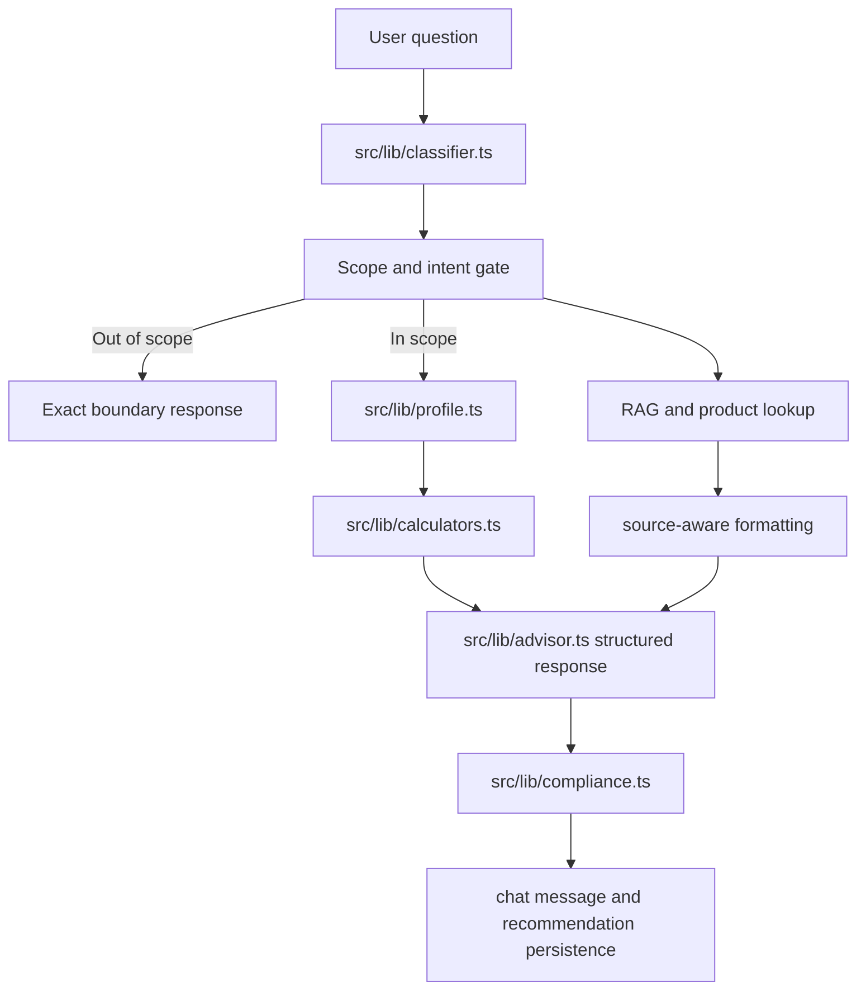

# Indian Health and Term Insurance Advisor Behavior

## Summary

Implement the assistant behavior contract for a focused Indian health insurance and term life insurance advisor. The change should tighten scope control, missing-data honesty, personalized follow-up questions, cover calculations, product comparison source handling, claim guidance, and compliance guardrails without turning the app into a generic finance chatbot.

---

## Problem Frame

The current app already has the right skeleton: authenticated chat, advisor orchestration, deterministic calculators, product data lookup, RAG citations, compliance checks, and persisted recommendations. The requested product behavior is more specific than the current implementation. Today, responses can be too generic, ask incomplete follow-ups, under-state source gaps, and rely on broad deterministic text instead of the requested structured advisor formats.

This plan keeps the existing architecture from `docs/requirements-and-technical-plan.md` and focuses on making the advisor reliably sound and behave like a calm, non-salesy Indian insurance explainer for only health insurance and term life insurance.

---

## Requirements

**Scope and classification**

- R1. The assistant must only answer health insurance, term life insurance, and related claim/concept/product comparison questions.
- R2. Out-of-scope questions such as mutual funds, stocks, loans, tax planning beyond insurance, motor insurance, travel insurance, ULIPs, and investment advice must receive the exact polite boundary message: "I can help only with health insurance and term life insurance."
- R3. Mixed or ambiguous health and term questions must avoid forcing a single product path when both categories are present.

**Personalized advice**

- R4. Personalized health advice must ask only the most important missing essentials first: age, city, covered members, existing personal cover, employer cover, pre-existing diseases, budget, and coverage preference.
- R5. Personalized term advice must ask only the most important missing essentials first: age, annual income, dependents, loans, existing life cover, liquid assets, tobacco status, and desired retirement age or policy duration.
- R6. Once enough profile data exists, health responses must provide the requested cover range logic for metro versus tier 2/3 cities, family floaters, individual cover, parents, and employer cover.
- R7. Once enough profile data exists, term responses must calculate cover as annual income times 10 to 15, plus loans and major goals, minus existing life cover and liquid assets.

**Source honesty and product comparisons**

- R8. Product comparison responses must use only structured product data or retrieved source documents and must show "Not found in source data" for missing fields.
- R9. The assistant must not invent premiums, claim settlement ratios, benefits, waiting periods, exclusions, riders, network hospitals, rankings, IRDAI rules, or insurer-specific terms.
- R10. When verified source data is missing, responses must say "I don't have verified data for that in the uploaded sources yet." and identify the needed source document type.
- R11. Responses that use retrieved data must cite source names already present in RAG citations or structured product records.

**Safety and claim guidance**

- R12. Health advice must consistently mention room rent limits, co-pay, deductible, PED waiting period, specific disease waiting period, restoration benefit, network hospitals, major exclusions, and claim process when relevant.
- R13. Term advice must consistently warn about correct cover, retirement-age duration, honest tobacco and medical disclosure, optional riders, suicide clause, and term insurance as protection rather than investment.
- R14. Claim guidance must never guarantee approval and must ask for policy type, diagnosis or event, waiting-period status, disclosure status, and hospitalization or nominee details before giving case-specific guidance.
- R15. Every final advisory response must recommend licensed human advisor review before final purchase or escalation for disputes.

**Tone and structure**

- R16. Concept explanations must use the requested sections: Simple answer, Why it matters, Example, What to check, and Advisor note.
- R17. Personalized recommendations must use the requested sections: Quick summary, What I understood, Recommended cover, What to prioritize, Red flags, and Next step.
- R18. The writing style must remain simple, calm, practical, honest, source-aware, and non-salesy.

---

## Key Technical Decisions

- KTD1. Centralize behavioral copy in advisor-layer formatters: `src/lib/advisor.ts` is already the orchestration point, so response structure should be assembled there or in small helper functions rather than duplicated across API routes.
- KTD2. Keep calculators deterministic: cover math belongs in `src/lib/calculators.ts`; advisor responses should explain calculator outputs rather than reimplementing formulas in prose.
- KTD3. Expand lightweight extraction only as needed: `src/lib/profile.ts` can support common natural-language fields such as family members, budget, employer cover, existing life cover, and liquid assets, but should not pretend to perform full underwriting.
- KTD4. Make product-data gaps explicit at formatting time: `src/lib/products.ts` should render missing fields as "Not found in source data" so comparison tables cannot accidentally imply unknown facts.
- KTD5. Treat compliance as a final safety net, not the main writer: `src/lib/compliance.ts` should catch unsafe language and missing disclaimers, while primary advisor formatting should already include the required warnings and structures.
- KTD6. Favor deterministic tests over provider-dependent tests: unit tests should validate classifier, calculator, formatter, missing-source, and compliance behavior without requiring OpenAI, Groq, Prisma, or network calls.

---

## High-Level Technical Design

---

## Implementation Units

### U1. Scope, Intent, and Missing-Question Behavior

- **Goal:** Make classification and follow-up behavior match the health-only and term-only advisor contract.
- **Files:** `src/lib/classifier.ts`, `src/lib/profile.ts`, `src/lib/advisor.ts`, `__tests__/advisor-behavior.test.ts`
- **Patterns:** Follow existing pure helper style in `src/lib/classifier.ts` and `src/lib/profile.ts`; avoid API-route-specific logic.
- **Test Scenarios:**
  - Out-of-scope investment, motor, travel, and ULIP questions return the exact boundary message.
  - Health advice with missing data asks only 3-5 essentials and starts with age, city, covered members, existing cover, or PED as appropriate.
  - Term advice with missing data asks only 3-5 essentials and starts with age, income, dependents, loans, or tobacco status as appropriate.
  - Claims queries are classified as claims without losing whether the underlying topic is health or term when keywords are present.
- **Verification:** `npm test -- --runInBand` if supported by Vitest, otherwise `npm test`.

### U2. Structured Advisor Response Formats

- **Goal:** Produce consistent concept, personalized recommendation, product comparison, claim, and source-missing formats in the requested tone.
- **Files:** `src/lib/advisor.ts`, `src/lib/compliance.ts`, `__tests__/advisor-behavior.test.ts`
- **Patterns:** Reuse `deterministicAnswer` as the provider-independent baseline; ensure LLM prompt mirrors the same contract when OpenAI is configured.
- **Test Scenarios:**
  - Concept explanation includes Simple answer, Why it matters, Example, What to check, and Advisor note.
  - Personalized health recommendation includes Quick summary, What I understood, Recommended cover, What to prioritize, Red flags, and Next step.
  - Personalized term recommendation includes the same personalized sections and explains the 10-15x formula.
  - Claims answer asks for case details and warns about rejection risks without promising approval.
  - All advisory responses include human advisor review language.
- **Verification:** `npm test`.

### U3. Cover Calculators and Profile Extraction Completeness

- **Goal:** Ensure health and term calculations have the inputs needed by the requested MVP logic and handle common Indian user phrasing.
- **Files:** `src/lib/calculators.ts`, `src/lib/profile.ts`, `__tests__/calculators.test.ts`
- **Patterns:** Keep numeric parsing conservative; only extract fields when phrasing is clear enough to avoid misleading personalization.
- **Test Scenarios:**
  - Metro individual health cover returns `10-15 lakh`; metro family floater returns `15-25 lakh`.
  - Tier 2/3 individual health cover returns `5-10 lakh`; tier 2/3 family floater returns `10-15 lakh`.
  - Parent or senior citizen cover adds separate-policy and co-pay/sub-limit/PED warnings.
  - Employer cover adds a warning but does not eliminate the need for personal cover.
  - Term cover calculation includes income multiplier, loans, future goals, existing life cover, and liquid assets.
  - Smoking or tobacco mention is retained as a disclosure warning, not as pricing or eligibility advice.
- **Verification:** `npm test`.

### U4. Product Comparison and Source Gap Handling

- **Goal:** Make comparison output source-aware and honest about missing verified data.
- **Files:** `src/lib/products.ts`, `src/lib/advisor.ts`, `src/lib/rag.ts`, `__tests__/products.test.ts`
- **Patterns:** Keep product table formatting deterministic; do not infer absent fields from insurer or product names.
- **Test Scenarios:**
  - Missing health product fields render as "Not found in source data".
  - Missing term product fields render as "Not found in source data".
  - Product comparison avoids "best" unless criteria are explicitly provided.
  - No product matches produces the uploaded-source missing-data sentence and lists needed documents such as policy wording, brochure, prospectus, premium chart, claim process document, or IRDAI/source document.
  - Source names from structured records and RAG citations appear when data is used.
- **Verification:** `npm test`.

### U5. UI and API Integration Guardrails

- **Goal:** Ensure the chat API persists the stricter answer metadata and the chat UI remains readable for structured markdown responses.
- **Files:** `src/app/api/chat/[id]/message/route.ts`, `src/app/chat/page.tsx`, `src/app/api/compliance-check/route.ts`
- **Patterns:** Follow existing App Router route handler shape and React markdown rendering already present in the chat page.
- **Test Scenarios:**
  - Sending an out-of-scope message persists the boundary response without creating misleading recommendations.
  - Sending a personalized recommendation request persists recommendation data only when a calculated cover range exists.
  - Markdown headings and tables render without overlapping the chat layout on desktop and mobile widths.
- **Verification:** `npm run lint`, `npm test`, `npm run build`, and browser smoke check of `/chat` when local auth/dev data allows it.

---

## Acceptance Examples

- AE1. Given the user asks "Which mutual fund should I buy?", when the advisor responds, then the response is only "I can help only with health insurance and term life insurance."
- AE2. Given the user asks "I am 32 in Mumbai, need health insurance for spouse and one child", when employer cover and PED details are missing, then the advisor asks a short set of follow-up questions rather than producing a fake final recommendation.
- AE3. Given the user asks "I earn 12 lakh, have 40 lakh loan and 2 kids. How much term cover?", when existing cover and liquid assets are missing, then the advisor explains the starting `1.2-1.8 crore` range and asks for the missing adjustment fields.
- AE4. Given a comparison product has no room rent value in structured data, when the table renders, then the field says "Not found in source data".
- AE5. Given a claim rejection question mentions diabetes hospitalization, when the advisor responds, then it asks about PED disclosure and waiting period status and avoids saying the claim will be approved.

---

## Scope Boundaries

- This work does not add new insurer scraping, premium quotation, payment, checkout, or lead-sale flows.
- This work does not expand into motor, travel, ULIP, investment, tax planning, mutual fund, loan, or stock advice.
- This work does not claim real-world product facts unless those facts exist in uploaded structured records or retrieved documents.
- This work does not replace licensed advisor, insurer, TPA, or ombudsman review for purchase or claim disputes.

---

## Risks & Dependencies

- The project uses Next.js 16.2.6, and `AGENTS.md` requires reading relevant docs under `node_modules/next/dist/docs/` before changing Next code.
- Existing files are currently uncommitted; implementation must preserve user/workspace changes and stage only intentional edits.
- Provider-backed responses can drift from deterministic behavior unless the OpenAI and Groq prompts are tightened to the same source-aware advisor contract.
- Product comparison quality is limited by the current uploaded mock data; missing source honesty is therefore part of the feature, not a temporary failure.

---

## Sources / Research

- `docs/requirements-and-technical-plan.md` establishes the app goal, non-goals, architecture, and verification commands.
- `src/lib/advisor.ts` currently orchestrates classification, profile extraction, RAG, product lookup, cover calculation, LLM fallback, compliance, recommendations, and handoff.
- `src/lib/calculators.ts` contains the existing deterministic health and term cover rules.
- `src/lib/classifier.ts` contains the current keyword classifier that needs stricter out-of-scope and mixed-topic handling.
- `src/lib/profile.ts` contains lightweight extraction and missing-field helpers.
- `src/lib/products.ts` formats comparison tables and is the right place to make missing source fields explicit.
- `__tests__/calculators.test.ts` shows the existing Vitest pattern for deterministic advisor logic.
